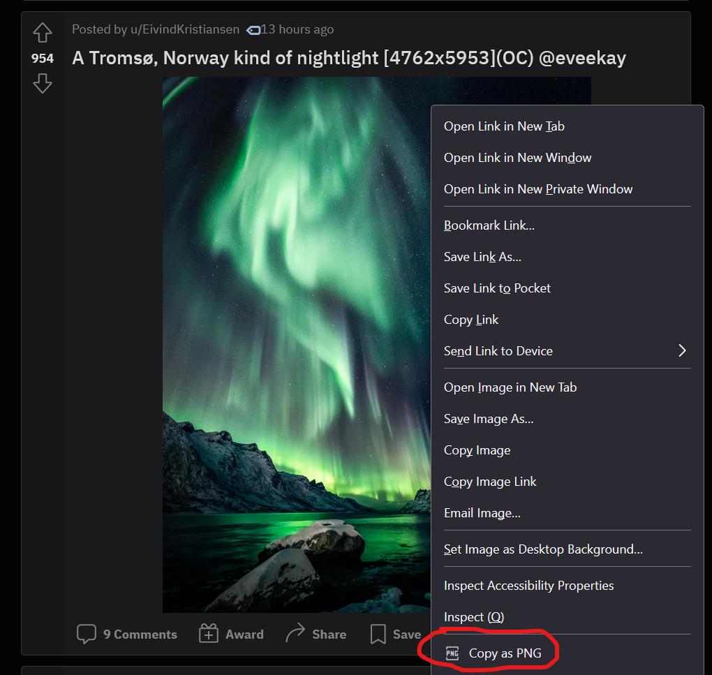

# Copy as PNG

A straightforward Firefox addon to allow you to copy any image as a PNG.

Built because I was sick of being unable to copypaste memes to my friends in Facebook Messenger because Reddit serves a lot of their images as WebP, which basically nothing else supports.
